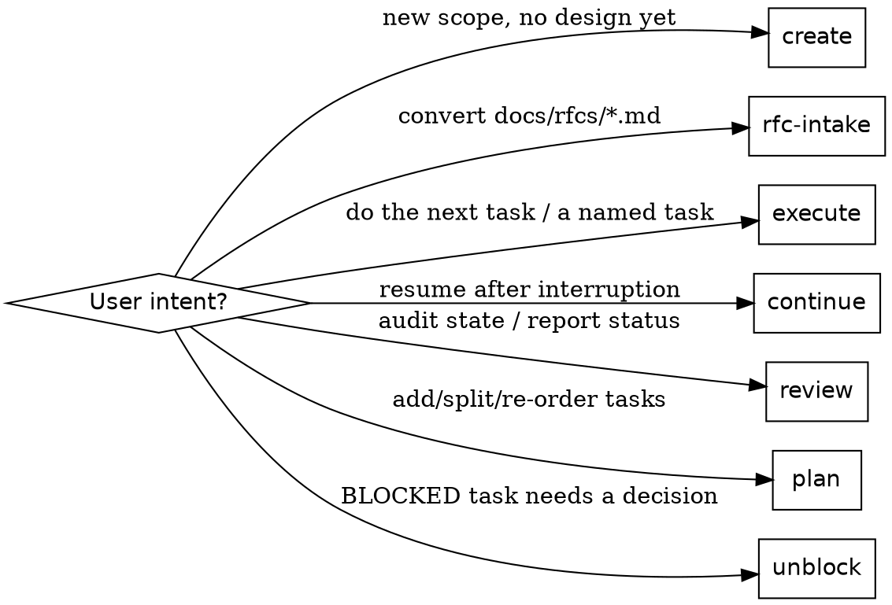

# Workstream Executor

## Overview

A **workstream** is a repo-local, agent-executable unit of scoped work stored at `.workstreams/<slug>/`. Each workstream has:

- `design.md` — the approved scope, decisions, non-goals, and acceptance criteria. Treat as a contract.
- `tracker.org` — an Org-mode task list that is the **single source of truth for progress**.
- (optional) `:SOURCE_RFC:` — if the workstream was derived from `docs/rfcs/<id>-*.md`, the RFC stays in the repo as the immutable source.

**Core principle:** the tracker is the only mutable record of progress. The agent advances exactly one task at a time, runs its `:VERIFY:` command, and only then marks it `DONE`. Scope creep into other tracker tasks during a single execution is forbidden.

## Pick a Mode First



If the request is ambiguous, default to **review** first, then ask which task to execute.

## Directory Layout

```
.workstreams/
  <slug>/
    design.md      # stable contract
    tracker.org    # mutable progress
    notes/         # optional: scratch, screenshots, perf traces
```

Slug rules: `kebab-case`, short noun phrase scoped to the work (`post-readiness-correctness-a11y`, `rope-workbench-legibility`). Never include dates or owner names.

## Tracker Schema

### TODO state machine

`TODO → NEXT → IN-PROGRESS → {DONE | BLOCKED | REVIEW}`

| State | Meaning | Rule |
|---|---|---|
| `TODO` | Not started | Default for new tasks |
| `NEXT` | Pulled into the queue, ready to execute | At most ~2 at a time |
| `IN-PROGRESS` | Currently being worked on | **Exactly one** task across the entire workstream |
| `BLOCKED` | Cannot proceed without an external decision | Must have a one-line reason as the first bullet |
| `REVIEW` | Implemented, waiting on user/code review | Use when verification passed but human sign-off is needed |
| `DONE` | Verified complete | Only after the task's `:VERIFY:` command passes |

### Required properties

Every executable task **must** have:

- `:FILES:` — space-separated paths the task is allowed to touch. Acts as a scope guard.
- `:VERIFY:` — exact shell command (chained with `&&`) that proves the task is done.

### Optional but encouraged

- `:RFC:` — RFC proposal IDs this task realizes (`P2`, `P5 P6`).
- `:EFFORT:` — Org effort estimate (`0:30`, `2:00`).
- `:DEPENDS:` — slugs of tasks (`Task 1 Task 4`) that must be `DONE` first.
- `:NOTES:` — link to a `notes/*.md` for traces, screenshots, perf numbers.

### Workstream metadata header

The top of every `tracker.org` carries one metadata block:

- `:SLUG:` — must match the directory name.
- `:DESIGN:` — relative path to `design.md` (always `design.md`).
- `:SOURCE_RFC:` — present iff RFC-derived; points to the RFC file.
- `:STATUS:` — `active`, `paused`, or `archived`.

## Operating Modes

### Create

1. Brainstorm scope with the user first if not already settled. (Use `superpowers:brainstorming` if available.)
2. Pick a slug.
3. Write `design.md` from `templates/design.md` filling Goal, Source, Accepted decisions, Scope, Non-goals, Acceptance criteria.
4. Write `tracker.org` from `templates/tracker.org` with a metadata header and a `DONE Task 0` that records the workstream-creation event.
5. Add one executable task per acceptance-criterion or per RFC proposal. Do **not** invent scope beyond `design.md`.

### RFC Intake

1. List `docs/rfcs/`. Read the referenced RFC end-to-end before writing anything.
2. Derive a slug from the RFC topic (not its number): `0001-post-readiness-correctness-and-a11y.md` → `post-readiness-correctness-a11y`.
3. Write `design.md` with **Source** linking the RFC, **Accepted decisions** resolving every RFC proposal, **Scope/Non-goals**, and **Acceptance criteria**.
4. Write `tracker.org` with one executable task per RFC proposal **unless** proposals are explicitly coupled (e.g. cleanup + rename in the same edit). Tag each task with `:RFC: P<n>`.
5. Preserve the RFC file. Never delete or rewrite it as part of intake.
6. Resolve obvious local decisions from `AGENTS.md`, `docs/design-principles.md`, and committed product direction. If a real choice remains, create a `BLOCKED` decision task with a clear question — never invent scope.
7. Close with `DONE Task 0: Convert RFC <id> into a tracked workstream` whose `:VERIFY:` asserts the RFC, design, and tracker files all exist.

### Plan

Use when the user asks to add, decompose, re-order, or re-scope tracker tasks.

- Keep `design.md` stable. Add tasks only for work that is already inside the design's scope.
- If decomposing, add child tasks **under** the parent (Org hierarchy), do not create a parallel tracker.
- Never silently merge `IN-PROGRESS` work into a new task.

### Execute (the hot loop)

1. Read `design.md`, then `tracker.org`. If `:SOURCE_RFC:` is set, skim the RFC.
2. Pick the next task:
   - If the user named one, use it.
   - Else pick the first `NEXT`, then the first `TODO` whose `:DEPENDS:` are all `DONE`.
3. Verify the one-in-progress invariant: there must be no other `IN-PROGRESS` task. If there is, stop and ask before flipping it.
4. Flip the chosen task to `IN-PROGRESS` (commit the tracker change separately is optional but recommended).
5. Implement **only inside the task's `:FILES:`**. If you must touch a file outside, stop and either expand `:FILES:` with a one-line justification under the task, or split off a new task.
6. Run the task's `:VERIFY:` exactly as written. Then run broader checks (`npm run check`, `npm run build`) when the touched code is load-bearing.
7. On success: flip to `DONE`. On a real blocker: flip to `BLOCKED` and add a one-line reason as the first bullet. On "needs review": flip to `REVIEW`.
8. Summarize using the wrap-up template below.

### Continue

The user said "continue" with no task name.

1. Find the single `IN-PROGRESS` task. If it exists, resume it — do not start a new task.
2. If none is `IN-PROGRESS`, fall through to **Execute** step 2.

### Review

Read-only. Produce a status report:

- Counts per state.
- The current `IN-PROGRESS` task (if any).
- The next 1–3 tasks the executor would pick.
- Any `BLOCKED` task with its reason.
- Whether the last `DONE` task's `:VERIFY:` still passes (re-run a cheap subset, e.g. `npm run typecheck`).

### Unblock

1. Read the `BLOCKED` reason aloud to the user verbatim.
2. Ask the one decision question. Do not propose code yet.
3. Once decided, record the decision in `design.md` under **Accepted decisions** (append, do not rewrite history), flip the task back to `TODO` or `NEXT`, and hand off to **Execute**.

## Verification Discipline

- Always run `:VERIFY:` exactly as written. Do not substitute a "faster" subset.
- If a task's `:VERIFY:` is missing, treat that as a planning bug: add one before proceeding. For this repo the safe defaults are:
  - Logic / math / lib: `npm test -- <path> && npm run typecheck`
  - SVG / component: `npm run check && npm run build`
  - Full integration: `npm run check && npm run build`
- For UI/canvas behavior changes, also run the available browser MCP and report what you visually confirmed (selection, focus ring, keyboard nav, no overlap).
- Never mark `DONE` based on "looks right" or a partial run.

## Editing Invariants

- `design.md` is stable. Edit only when the user changes scope; append, do not rewrite.
- `tracker.org` is the only progress record. Do not stash status in commit messages or chat.
- Preserve Org syntax: `#+TODO:` header, `:PROPERTIES:`/`:END:` blocks, state keywords from the configured set.
- One `IN-PROGRESS` across the workstream — always.
- Files outside the task's `:FILES:` are out of bounds for that task.
- Respect user-modified files; never reset or revert work the user did between turns.

## Wrap-Up Template

After every execute pass, output exactly:

```
Workstream: <slug>
Task: <state> <task heading>
Files changed: <list>
Verify: <command> → pass | fail
Next task: <heading or "none">
Notes (optional): <blockers, follow-ups>
```

## Common Mistakes

| Mistake | Fix |
|---|---|
| Bundling two tracker tasks in one execution | Stop, finish the first, then start the second |
| Editing `design.md` mid-execution | Only the **Unblock** mode may edit it, and only the Accepted-decisions section |
| Marking `DONE` before `:VERIFY:` passes | Re-open the task; verify; then mark |
| Flipping a second task to `IN-PROGRESS` | One at a time — stop and ask |
| Touching files outside `:FILES:` | Expand `:FILES:` with a justification, or split the task |
| Inventing scope from an RFC | Make it a `BLOCKED` decision task instead |
| Renaming a task heading after work has started | Add a child bullet noting the rename; keep the original heading stable |

## Quick Reference

- Skeletons live next to this file: `templates/design.md`, `templates/tracker.org`.
- This repo's verify suite: `npm run check` (test + lint + typecheck), `npm run build`, `npm test -- <path>`.
- This repo's RFC location: `docs/rfcs/<NNNN>-<slug>.md`.
- Existing workstreams to mirror: `.workstreams/post-readiness-correctness-a11y/`, `.workstreams/rope-workbench-legibility/`.
