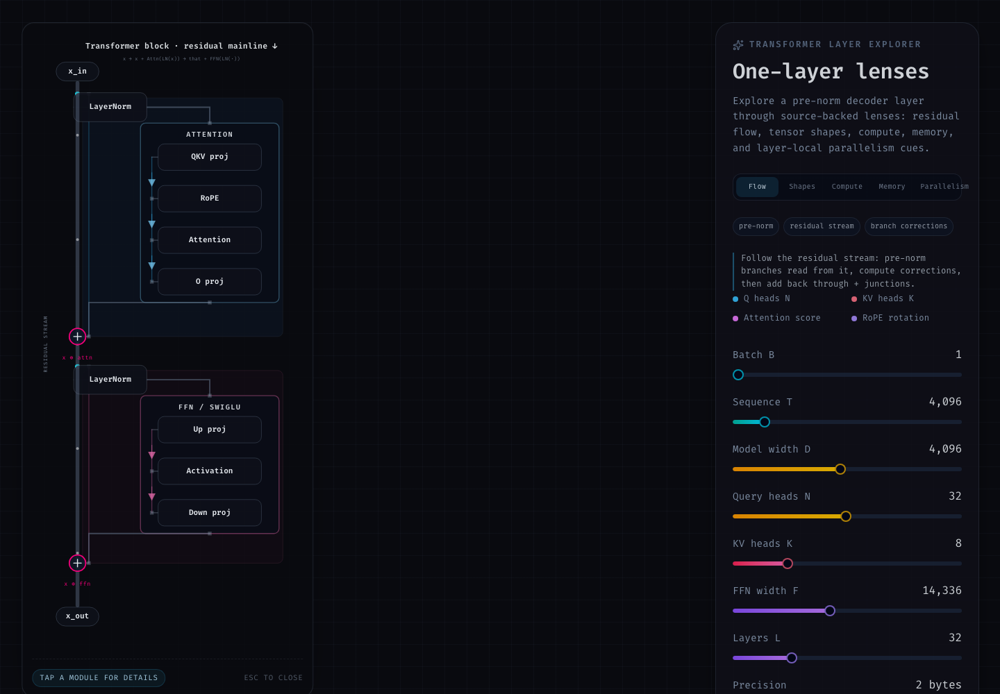

<p align="center">
  
</p>

# Lumina

Lumina is an interactive transformer-layer exploration workbench. It started as a RoPE visualizer, but now covers the full shape of one pre-norm decoder layer: residual flow, Attention, FFN/SwiGLU, tensor shapes, compute/memory accounting, KV cache behavior, parallelism cues, and RoPE mechanics.

<p align="center">
  
</p>

## Demo

GitHub Pages deployment is configured for:

```text
https://phi9t.github.io/lumina/
```

The Pages workflow builds from `main` and deploys the static `dist/` output.

## Learning the Codebase

If you are new to frontend or visualization design, start with **[docs/learning-guide.md](docs/learning-guide.md)**. It walks through:

- The three-panel layout and where state lives
- A suggested file reading order (10 stops)
- SVG circuit-diagram patterns used on the left
- Why formulas live in the center drawer, not on the map
- Hands-on exercises you can try in a few minutes

Product constraints live in [docs/design-principles.md](docs/design-principles.md).

## Current Experience

- **Left:** compact SVG transformer block map with residual mainline, Attention branch, FFN/SwiGLU branch, and residual `+` merges.
- **Center:** selected-module detail drawer with tensor path, source cue, formula, accounting metrics, and implementation-style pseudocode.
- **Layer lenses:** flow, shapes, compute, memory, and parallelism views grounded in the same layer model.
- **RoPE workbench:** Identity, Cache, and Spectrum views for interactively exploring rotary position behavior.
- **Right:** persistent layer controls, source-concept chips, KV cache estimates, and live compute/memory/shape readouts.
- **Execution mode:** decode / prefill / training retargets the forward FLOP and activation accounting (decode = one query token against the full KV cache).

## Stack

- React 19
- Vite 8
- TypeScript 6
- Tailwind CSS 4
- Framer Motion
- Radix Slider
- Vitest and ESLint for local verification

## Requirements

- Node.js 22 or newer
- npm 10 or newer

## Development

```bash
npm ci
npm run dev
```

Open the URL printed by Vite, usually `http://localhost:5173`.

## Scripts

```bash
npm run test       # Run Vitest unit tests
npm run lint       # Run ESLint
npm run typecheck  # Run TypeScript project checks
npm run check      # Run test + lint + typecheck
npm run build      # Run typecheck + production Vite build
npm run preview    # Serve the production build locally
```

## Project Structure

```text
src/
  App.tsx                         # Three-column app layout and shared state
  TransformerBlockView.tsx        # Compact SVG transformer block selector
  components/dashboard/           # Right-hand layer dashboard and controls
  components/block/               # SVG block primitives and detail drawer
  components/rope/                # RoPE workbench and 2D views
  components/ui/                  # Small local UI primitives
  lib/layerModel.ts               # Layer accounting, lenses, KV cache estimates
  lib/ropeMath.ts                 # Pure RoPE math helpers
  types/blockSelection.ts         # Shared selected-module types
```

Supporting docs:

- `docs/learning-guide.md` — **start here** if you are learning frontend or vis design from this repo.
- `docs/design-principles.md` captures the product/design constraints.
- `docs/transformer-math-notes.md` maps source-backed transformer formulas to the implementation.
- `.workstreams/rope-workbench-legibility/` contains the completed workstream design and tracker.
- `docs/superpowers/plans/2026-05-23-production-readiness.md` records the production-hardening plan.

## Architecture Notes

- The left transformer block is intentionally a compact navigation map. It avoids inline formulas, tensor badges, and accounting text.
- Detailed explanations live in `DetailDrawer`, backed by `layerModel`.
- RoPE 2D workbench views are primary:
  - `RopeIdentityView` shows absolute vs relative dot-product identity.
  - `RopeCacheView` shows left-to-right KV cache behavior.
  - `RopeSpectrumView` shows fast-to-slow RoPE frequency pairs.
- `ropeTypes.ts` holds the shared RoPE state types consumed across the workbench views.

## Verification

Before committing changes, run:

```bash
npm run check
npm run build
```

CI runs the same checks on pushes and pull requests to `main` via `.github/workflows/ci.yml`.

## Production Build

```bash
npm ci
npm run build
```

The static output is written to `dist/` and can be deployed to any static host.

For GitHub Pages, the workflow sets `GITHUB_PAGES=true`, which makes Vite build with `base: /lumina/`.

## Design Direction

The UI should remain a strict industrial technical workbench:

- Matte carbon/slate surfaces
- Sharp borders and squared circuit wiring
- FiraCode Nerd Font labels
- Compact left-side navigation diagram
- Center-first math/detail explanations
- Right-side persistent controls

See [docs/design-principles.md](docs/design-principles.md) for the full design contract.
