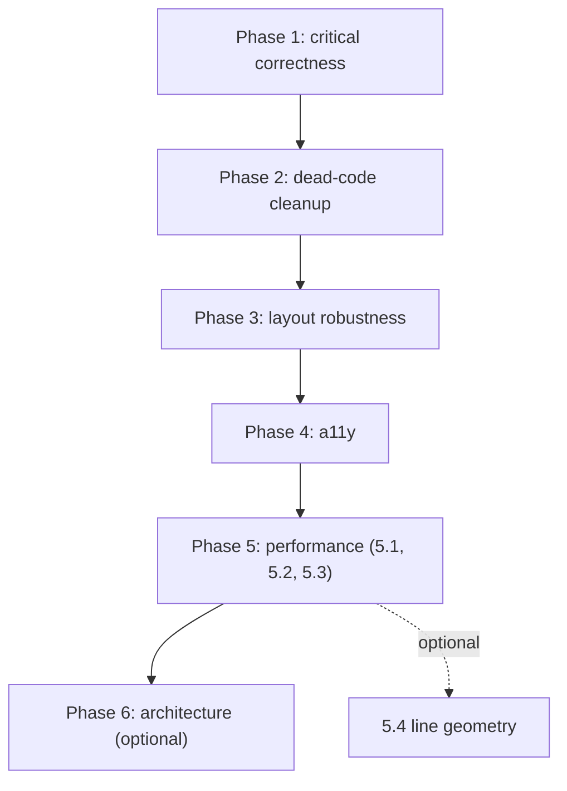

# Code review fix plan

Detailed plan for fixes derived from a deep review of `src/`, captured for incremental execution. Phases are independent; lower phases are higher leverage and lower risk.

## Summary of issues found

| Severity | Count | Examples |
|----------|-------|----------|
| Critical correctness | 5 | Esc handler deps, `firstTheta` math, step-chain overflow, `posJ` stale state, ESLint blocker |
| Dead code / unused | 9 | `Button`, horizontal `MainlineRail`, `isSelected`, `branch-wire-halo`, `observatory-orb`, etc. |
| Layout robustness | 3 | FFN tee label collision, magic numbers, vertical caption clipping |
| Accessibility | 2 | No keyboard nav on SVG modules, `role="img"` blocks descendants |
| Performance | 4 | Eager RoPE 3D bundle, `useMemo` constants, `Stars`, fan line geometry |
| Architecture (optional) | 3 | 657-line RoPE file, duplicate type re-exports, `Card` housekeeping |

---

## Phase 1 — Critical correctness (low risk, must-fix)

### 1.1 Esc handler dep list — `src/App.tsx:15-22`
Effect re-mounts a fresh listener every time `selected` changes, and the early `if (!selected) return` means no listener is installed while the drawer is closed.

**Change**: remove the `selected` dependency and the early return; install once.

```tsx
useEffect(() => {
  const onKey = (e: KeyboardEvent) => {
    if (e.key === 'Escape') setSelected(null)
  }
  window.addEventListener('keydown', onKey)
  return () => window.removeEventListener('keydown', onKey)
}, [])
```

**Verify**: open/close drawer repeatedly via click + Esc; React DevTools shows one effect run total.

### 1.2 `relativePhase` math + label — `src/RopeThreeJSVisualizer.tsx:566-569,644-645`
`firstTheta = 1 / base^(0/headDim) = 1`, so the "Fastest phase gap" stat ignores `base` and `headDim` sliders, and the label is misleading (slowest pair, not fastest).

**Change**:

```ts
const pairs = Math.max(1, Math.floor(headDim / 2))
const fastestTheta = 1 / Math.pow(base, (2 * (pairs - 1)) / headDim)
const relativePhase = Math.abs(delta) * fastestTheta
```

Update displayed label to "Fastest pair phase gap" and the explanatory paragraph at line 647 to mention "fastest pair (n = d/2 − 1)".

**Verify**: move base from 1000 → 50000 with fixed `i`, `j`, `headDim`; stat changes monotonically. Move headDim 16 → 128; stat changes.

### 1.3 Step-chain layout safety — `src/components/block/BranchCircuit.tsx:50-56`
`stepGap` can be negative when `innerH < HEADER_H + CARD_H`; `chainBottom` can exceed `shellBottom` so the last plate floats outside the shell.

**Change**:
- Add `MIN_STEP_GAP = 48` near existing constants.
- Clamp: `stepGap = Math.max(MIN_STEP_GAP, Math.min(MAX_STEP_GAP, …))`.
- After clamping, if `chainBottom + CARD_H/2 + SHELL_PAD_BOTTOM > junctionY - 12`, `console.warn` in dev with the required span.
- Optional helper `minBranchSpan(stepCount)` re-exported for use in `TransformerBlockView.tsx` to assert constants.

**Verify**: set `Y_J1 - Y_ATTN_TEE = 180` (tight) and confirm plates remain inside shell or warning fires.

### 1.4 `posJ` clamp on write — `src/App.tsx:24-29` + `src/RopeThreeJSVisualizer.tsx:606-614`
When `posI = 0`, j slider max is 1; user drags j to 1, parent clamps to `effectiveJ = 0`, but raw `posJ` stays at 1. When `posI` later grows, j visually jumps.

**Change**:

```tsx
const setPosJClamped = useCallback(
  (j: number) => setPosJ(Math.min(j, posI)),
  [posI],
)
```

Pass `setPosJ={setPosJClamped}` to `RopeDashboard`. Drop the `effectiveJ` recomputation in App body (the state is now always valid).

**Verify**: set i = 0, drag j slider to max; release; bump i to 20; j should remain 0.

### 1.5 ESLint blocker / unused `Button` — `src/components/ui/button.tsx`
`react-refresh/only-export-components` fails `npm run lint`; `Button` is not used anywhere.

**Change**: delete the file. (Alternative: split into `button-variants.ts` + `button.tsx` if Button is wanted in the future.)

**Verify**: `npm run lint` exits 0.

---

## Phase 2 — Dead code cleanup (zero behavior change)

| Drop | Location | Notes |
|------|----------|-------|
| `MainlineRail` (horizontal) | `MainlineRail.tsx:15-21` | Only `MainlineRailVertical` is consumed |
| `gradientId` prop | `MainlineRail.tsx:8-12` | Never referenced in implementation |
| `isSelected` helper | `blockSelection.ts:15-21` | No consumers |
| `block-view--focused` conditional class | `TransformerBlockView.tsx:59` | No matching CSS rule |
| `.mainline-glow`, `.branch-wire-halo` CSS rules and `--mainline-glow`, `--branch-stroke-halo` vars | `index.css:60,51,172-174,201-207` | All hide-only/transparent |
| `<path className="branch-wire-halo">` × 3 per branch | `BranchCircuit.tsx:112,114,116` | Rendered then hidden — wasted DOM |
| `.observatory-orb`, `.observatory-orb--cyan/violet` divs | `App.tsx:34-35` | No CSS rules; orphan markup |
| `branch-circuit--ffn .branch-wire-halo` override | `index.css:205-207` | Goes away with halo removal |

**Verify**: `npm run build && npm run lint` clean; visual regression by eye in dev server.

---

## Phase 3 — Layout robustness

### 3.1 FFN tee / junction label collision — `src/TransformerBlockView.tsx:17`
`Y_FFN_TEE = Y_J1 + 40` but `JunctionNode` renders its label at `y + 36`, so the FFN entry wire passes within 4px of the "x ⊕ attn" label.

**Change**: bump `Y_FFN_TEE = Y_J1 + 56` and add a comment explaining the constraint. Alternatively expose `labelOffset` on `JunctionNode` and place the label above the junction when a branch tees off immediately below.

**Verify**: inspect SVG; label baseline and branch wire separated by ≥12px.

### 3.2 Centralize magic numbers — `src/components/block/BranchCircuit.tsx:105-131`
Mixed inline offsets (`shellTop + 18`, `+32`, corner half-size `3`, tap inset `6`).

**Change**: add named constants at the top of the file:

```ts
const SHELL_TITLE_Y_OFFSET = 18
const SHELL_FORMULA_Y_OFFSET = 32
const CORNER_HALF = 3
```

Use throughout. No behavior change.

### 3.3 Caption clipping on narrow viewports — `src/TransformerBlockView.tsx:90-100`
Rotated "residual stream" caption sits at `x = MAINLINE_X - 48 = 24`; with `overflow: visible` and narrow containers it can poke outside the frame padding.

**Change**: either shift everything `+24` (bump `VIEW_W` to 484), or replace the vertical caption with a horizontal label above the `x_in` pill.

**Verify**: resize left column to ~360px; caption stays visible.

---

## Phase 4 — Accessibility

### 4.1 Keyboard support for SVG modules — `ModuleNode.tsx`, `JunctionNode.tsx`
`<motion.g onClick=…>` is mouse-only.

**Change**: add `role="button"`, `tabIndex={0}`, `aria-label`, and `onKeyDown` mapping Enter/Space to `onSelect()`:

```tsx
<motion.g
  role="button"
  tabIndex={0}
  aria-label={`${label}${sub ? ` (${sub})` : ''}`}
  onClick={onSelect}
  onKeyDown={(e) => {
    if (e.key === 'Enter' || e.key === ' ') { e.preventDefault(); onSelect() }
  }}
  …
/>
```

Add focus CSS:

```css
.module-rect:focus-visible {
  outline: 2px solid var(--module-stroke-active);
  outline-offset: 2px;
}
```

**Verify**: Tab through; Enter on each module opens drawer; Esc closes.

### 4.2 SVG role and decorative `aria-hidden` — `TransformerBlockView.tsx:53-57`
`role="img"` on an SVG marks all descendants inaccessible.

**Change**: switch to `role="group"` (or remove the role). Add `aria-hidden="true"` to corridor `<rect>`s, `<defs>`, and decorative halo `<path>`s.

**Verify**: VoiceOver / NVDA reads the title and announces each module as a button.

---

## Phase 5 — Performance

### 5.1 Lazy-load RoPE 3D panel — `DetailDrawer.tsx:3,171-177`
1.42 MB JS bundle includes three.js + drei + Stars even before the user opens the RoPE drilldown.

**Change**:

```tsx
const RopeDetailPanel = lazy(() =>
  import('@/RopeThreeJSVisualizer').then((m) => ({ default: m.RopeDetailPanel })),
)
// in DetailBody:
<Suspense fallback={<div className="detail-placeholder">Loading RoPE panel…</div>}>
  <RopeDetailPanel {...ropeState} />
</Suspense>
```

`RopeDashboard` stays statically imported in `App.tsx`.

**Verify**: `npm run build` shows a separate chunk; initial JS payload drops ≥600 KB raw.

### 5.2 Hoist `qBase` / `kBase` to module constants — `RopeThreeJSVisualizer.tsx:431-432`

```ts
const Q_BASE: Vec2 = [0.9, 0.35]
const K_BASE: Vec2 = [0.55, 0.85]
```

Drop the two `useMemo` calls.

### 5.3 Remove `Stars` and inert lights — `RopeThreeJSVisualizer.tsx:445,447-448`
1200 stars + secondary directional light conflict with the "less shiny / not bloom-heavy" preference in `AGENTS.md`.

**Change**: remove `<Stars …>` and the secondary directional light (line 448). Keep ambient + key directional.

**Verify**: visual check; preference doc satisfied.

### 5.4 KV cache fan geometry (optional) — `RopeThreeJSVisualizer.tsx:359-373`
Up to ~50 `<Line>` instances per render.

**Change**: replace the fan with a single `<lineSegments>` built from a flat `Float32Array` of endpoints in `useMemo`; the selected j-line drawn as a separate `<Line>` overlay.

**Verify**: drei profiler shows one draw call for the fan.

---

## Phase 6 — Architecture (optional, larger refactor)

### 6.1 Split `RopeThreeJSVisualizer.tsx` (657 lines)

```
src/rope/
  Scene.tsx                — Scene, FrequencyPlane, PhaseWaveLane
  KvCacheTimeline.tsx      — KvCacheTimeline + RAIL constants
  primitives.tsx           — Arrow2D, UnitCircle, CirclePositionMarker, AttentionEdge2D
  palette.ts               — PALETTE constant
  geometry.ts              — railSpan, xAtPosition, cachePoint, rotate2D, dot
  RopeDetailPanel.tsx      — Canvas wrapper
  RopeDashboard.tsx        — Dashboard + LegendItem + ControlRow
  types.ts                 — Vec2, Vec3, RopeStateProps, RopeDashboardProps
```

Keep `src/RopeThreeJSVisualizer.tsx` as a re-export shim for one release, then delete.

### 6.2 Canonical types — `BranchCircuit.tsx:5` + `TransformerBlockView.tsx:1`
Two import paths for `BranchDef`/`CircuitModuleDef`. Delete re-exports from `BranchCircuit`; import directly from `@/components/block/circuitTypes`.

### 6.3 `Card` housekeeping — `src/components/ui/card.tsx`
Currently only `Card`/`CardContent` exist. Either expand with `CardHeader`/`CardTitle` for future sections, or replace the single use in `RopeThreeJSVisualizer.tsx:577` with a plain `<div>` and delete the file.

---

## Execution order



Phases 1–2 land in one commit each; 3 and 4 can be combined; 5.1 is the biggest perf win and should be its own commit so the chunk-split shows clearly in the diff. Phase 6 is optional.

## Out of scope

- RoPE math changes beyond the `firstTheta` fix.
- Multi-block / multi-layer view, MoE expert routing, additive vs RoPE comparison.
- Replacing `framer-motion` or `three.js`.
- Tailwind class consolidation across `App.tsx` / dashboard.
- Adding a test framework.

## Verification checklist (run after each phase)

- `npm run lint` exits 0.
- `npm run build` exits 0; note initial-chunk gzip size before/after Phase 5.1.
- Manual: open dev server, click each module; confirm drawer opens with correct title; Esc closes; keyboard Tab + Enter reaches each module (Phase 4).
- Slider check (Phase 1.2 / 1.4): vary `base` / `headDim` and confirm the stat changes; set `posI = 0`, drag `posJ`, then increase `posI` and confirm `posJ` doesn't snap to a stale value.
