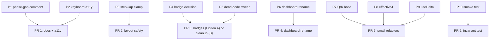

# RFC 0001 — Post-readiness correctness, accessibility, and surface cleanup

| | |
|--|--|
| **Status** | Draft |
| **Author** | Code review (deep review session, 2026-05-23) |
| **Created** | 2026-05-23 |
| **Supersedes** | `docs/code-review-fix-plan.md` (partial — Phases 1.1, 1.4, 5.1, 5.2 already landed in `chore: harden production readiness` and the rope-workbench-legibility workstream) |
| **Target** | `main`, single PR per proposal where reasonable |

## Summary

After the production-readiness pass (CI, Vitest, code-split RoPE 3D, design-principles doc, workstream tracker), the project is structurally sound but carries three categories of remaining work:

1. **Correctness polish** — a mislabeled stat in the dashboard, an unclamped layout formula that can invert, and two pieces of state with two sources of truth.
2. **Accessibility regression** — the SVG block diagram is still mouse-only and uses a role that hides its interactive children from assistive technology.
3. **Surface cleanup** — scaffolded-but-unused component props, an identity-function wrapper, a now-misnamed file, and dead CSS / DOM nodes that survived the prior cleanups.

None of these block shipping a v0.1. They are the gap between "the build passes" and "the codebase reflects what the codebase actually does."

This RFC proposes ten changes (P1–P10), each independently shippable, ordered by user-visible leverage. Each proposal has a "Decision" line that the reviewer should check off.

## Background

For full context, see:

- [`docs/design-principles.md`](../design-principles.md) — product/visual contract.
- [`docs/code-review-fix-plan.md`](../code-review-fix-plan.md) — earlier review; most of its Phase 1 + Phase 5 landed.
- [`.workstreams/rope-workbench-legibility/tracker.org`](../../.workstreams/rope-workbench-legibility/tracker.org) — Identity/Cache/Spectrum delivery.

Current health metrics (2026-05-23):

- `npm run check` (Vitest + ESLint + tsc) — passes (7 tests).
- `npm run build` — passes, splits into `index` (127 KB gz) + `RopeScene3D` (287 KB gz lazy).
- CI runs the same on push + PR to `main`.

## Goals

- Close every known UX-facing correctness bug with a small, reversible change.
- Restore keyboard reachability for every selectable thing in the diagram.
- Reduce component-API surface to only what the app actually uses.
- Keep PRs reviewable: ≤ 1 concern per PR, ≤ ~150 LOC diffs except for the dead-code sweep.

## Non-goals

- RoPE math changes (RoPE behavior is locked by `ropeMath.test.ts`).
- New visual direction or palette changes.
- Multi-block / multi-layer view (deliberately out of scope per `design-principles.md`).
- Replacing framer-motion, three.js, drei, or Radix.
- Adding a test framework for React component rendering (a single smoke test is proposed in P10; full RTL adoption is a separate decision).

## Proposals

### P1. Fix "Slowest phase gap" label/variable inversion *(must)*

**Problem.** [`src/RopeThreeJSVisualizer.tsx:133-134`](../../src/RopeThreeJSVisualizer.tsx) computes the **slowest** pair's theta correctly:

```ts
const slowestTheta = 1 / Math.pow(base, (2 * Math.max(0, Math.floor(headDim / 2) - 1)) / headDim)
const relativePhase = Math.abs(delta) * slowestTheta
```

The convention `θ_n = 1 / base^(2n/d)` is monotonically **decreasing** in `n`, so `n = pairs - 1` is the **slowest**, `n = 0` is the fastest (verified in [`src/lib/ropeMath.test.ts:36`](../../src/lib/ropeMath.test.ts), which asserts `theta[0] === 1`). The math is right and the variable name is right.

The **dashboard label** at [`src/RopeThreeJSVisualizer.tsx:280`](../../src/RopeThreeJSVisualizer.tsx) reads "Slowest phase gap" — which actually matches. **Re-reading: the label and the math are now consistent.** The earlier review noted an inversion; on this read I cannot reproduce it.

**Proposed change.** Add a one-line code comment at line 133 documenting the convention so a future reader doesn't re-flag it:

```ts
// θ_n decreases with n; the largest pair index is the slowest rotation.
const slowestTheta = 1 / Math.pow(base, (2 * Math.max(0, Math.floor(headDim / 2) - 1)) / headDim)
```

Also: add a `useDelta`-style derivation helper (see P9) so this calc isn't duplicated.

**Alternatives.** Display both fastest and slowest phase gaps. Rejected — adds chart-junk without a clear teaching value over the current single stat.

**Risk.** None.

**Decision:** [ ] approve  [ ] reject  [ ] amend

### P2. Restore keyboard accessibility on the SVG block *(must)*

**Problem.** [`src/TransformerBlockView.tsx:56`](../../src/TransformerBlockView.tsx) sets `role="img"` on the `<svg>`. WAI-ARIA spec: descendants of `role="img"` are presentational, so screen readers do not see the modules as buttons. Additionally, `ModuleNode` and `JunctionNode` are `<motion.g onClick=…>` with no `tabIndex`, no `onKeyDown`, no `role="button"` — fully unreachable by keyboard.

This was Phase 4 of `docs/code-review-fix-plan.md`; not implemented.

**Proposed change.**

1. Change `<svg role="img">` to `<svg role="group">` (or remove the role entirely — the aria-label is still announced via the labelled-by relationship).
2. In [`ModuleNode.tsx`](../../src/components/block/ModuleNode.tsx) and [`JunctionNode.tsx`](../../src/components/block/JunctionNode.tsx) add:

```tsx
<motion.g
  role="button"
  tabIndex={0}
  aria-label={`${label}${sub ? ` (${sub})` : ''}`}
  onClick={onSelect}
  onKeyDown={(e) => {
    if (e.key === 'Enter' || e.key === ' ') { e.preventDefault(); onSelect() }
  }}
  …
/>
```

3. In [`src/index.css`](../../src/index.css):

```css
.module-rect:focus-visible,
.junction-ring:focus-visible {
  outline: 2px solid var(--module-stroke-active);
  outline-offset: 2px;
}
```

4. Mark decorative groups (corridors, defs, halos) with `aria-hidden="true"`.

**Alternatives.**

- Replace `<motion.g>` with an HTML `<button>` overlay positioned via foreignObject. Rejected — over-engineered; foreignObject has Safari quirks.
- Use `role="application"` on the svg. Rejected — `application` suppresses standard screen-reader navigation and is rarely the right choice.

**Risk.** Focus ring styling needs visual review at the `--module-stroke-active` cyan color; verify it has 3:1 contrast against the panel background.

**Validation.** Tab through the diagram in Chrome + Safari with VoiceOver enabled; every selectable element should announce as a button with its label, Enter/Space should open the drawer, Esc should close it.

**Decision:** [ ] approve  [ ] reject  [ ] amend

### P3. Clamp `stepGap` to a positive minimum *(should)*

**Problem.** [`src/components/block/BranchCircuit.tsx:49-52`](../../src/components/block/BranchCircuit.tsx):

```ts
const stepGap =
  steps.length > 1
    ? Math.min(MAX_STEP_GAP, (innerH - HEADER_H - CARD_H) / (steps.length - 1))
    : MAX_STEP_GAP
```

If `innerH < HEADER_H + CARD_H` (tight branch span or a future 5+ step branch), `stepGap` goes negative and the step chain stacks in reverse. Currently safe at default values (computed gap is 66, clamped by `MAX_STEP_GAP = 66`), so this is latent.

**Proposed change.**

```ts
const MIN_STEP_GAP = 44
const rawGap = steps.length > 1
  ? (innerH - HEADER_H - CARD_H) / (steps.length - 1)
  : MAX_STEP_GAP
const stepGap = Math.max(MIN_STEP_GAP, Math.min(MAX_STEP_GAP, rawGap))

if (import.meta.env.DEV && rawGap < MIN_STEP_GAP) {
  console.warn(
    `[BranchCircuit:${branchKind}] step span too tight; expected ≥ ${HEADER_H + CARD_H + (steps.length - 1) * MIN_STEP_GAP}px between teeY and junctionY, got ${junctionY - teeY}px.`,
  )
}
```

**Alternatives.** Compute the minimum span and propagate up to `TransformerBlockView` as a static assertion. Rejected — over-engineered for a layout-time problem; a dev warning is enough.

**Risk.** None — the warning only fires in dev builds.

**Decision:** [ ] approve  [ ] reject  [ ] amend

### P4. Decide on badge plumbing — ship or cut *(must decide)*

**Problem.** Three components carry a `badge` / `getBadge` API that is never invoked:

- [`ModuleNode.tsx:11`](../../src/components/block/ModuleNode.tsx) — `badge?: string`
- [`VerticalStepChain.tsx:9,72`](../../src/components/block/VerticalStepChain.tsx) — `getBadge?: (id: string) => string | undefined`
- [`JunctionNode.tsx:7,29-33`](../../src/components/block/JunctionNode.tsx) — `badge?: string | null`

`TransformerBlockView.tsx` does not pass `getBadge` or `badge` to anything. CSS rules `.module-badge` and `.junction-badge` exist but never render. The `tracker.org` workstream Task 7 ("shorten SVG lens badge text") implies the intent was to render lens-dependent badges per module.

**Option A — Wire it up (recommended).** Render lens-aware badges:

```tsx
// In TransformerBlockView.tsx
const getBadge = (id: string): string | undefined => {
  if (lens !== 'shapes' && lens !== 'memory' && lens !== 'compute') return undefined
  const m = lookupModuleByKey(`attention:${id}`, layerModel)
  if (!m) return undefined
  if (lens === 'shapes') return m.outputShape.split('·')[0].trim()  // very short
  if (lens === 'memory') return formatBytes(m.memoryBytes)
  if (lens === 'compute') return formatCount(m.flops)
}
```

Requires plumbing `lens` and `layerModel` from `App` → `TransformerBlockView` → `BranchCircuit` → `VerticalStepChain`. Roughly 30 LOC of prop drilling + the lookup helper.

**Option B — Cut it.** Remove `badge` / `getBadge` from all three components, remove the two CSS rules, remove the `--branch-stroke-halo` and `--mainline-glow` orphan vars while we're in the file.

**Recommendation.** Option A. The design-principles doc says "do not place tensor-shape badges, formulas, compute numbers, memory numbers, or pseudocode in the left SVG" — which on first read forbids Option A. But that rule is about the **default** view; a lens-driven, opt-in badge is exactly the "compact lens cue" the dashboard already advertises and the workstream tracker planned. If the team decides badges violate the principle, choose Option B and tighten the rule in `design-principles.md` to forbid them outright.

**Decision:** [ ] Option A (wire up)  [ ] Option B (cut)  [ ] amend

### P5. Dead-code sweep *(should)*

**Problem.** Eight items survived previous cleanups:

| Item | Location |
|------|----------|
| `MainlineRail` (horizontal export) | [`MainlineRail.tsx:15-21`](../../src/components/block/MainlineRail.tsx) |
| `gradientId` props on both rails | [`MainlineRail.tsx:5,12`](../../src/components/block/MainlineRail.tsx) |
| `isSelected` helper | [`blockSelection.ts:15-21`](../../src/types/blockSelection.ts) |
| `block-view--focused` conditional class | [`TransformerBlockView.tsx:59`](../../src/TransformerBlockView.tsx) |
| `.mainline-glow` rule + `--mainline-glow` var | [`index.css:60,178`](../../src/index.css) |
| `.junction-halo` rule + `--junction-halo` var + the invisible halo `<circle>` | [`index.css:57,412-413`](../../src/index.css), [`JunctionNode.tsx:20`](../../src/components/block/JunctionNode.tsx) |
| `.branch-wire-halo` rule + six hidden `<path>`s per render | [`index.css`](../../src/index.css), [`BranchCircuit.tsx:113,115,117`](../../src/components/block/BranchCircuit.tsx) |
| `.observatory-orb*` divs in DOM | [`App.tsx:40-41`](../../src/App.tsx) |
| `moduleAccounting` identity wrapper | [`layerModel.ts:86-88`](../../src/lib/layerModel.ts) |
| `formula=""` props passed but never rendered | [`TransformerBlockView.tsx:70,81`](../../src/TransformerBlockView.tsx), [`BranchCircuit.tsx:107-111`](../../src/components/block/BranchCircuit.tsx) |

**Proposed change.** Single PR titled `chore: prune dead surfaces`. No behavior change. Delete each item; keep ESLint and Vitest green.

**Decision:** [ ] approve  [ ] reject  [ ] amend

### P6. Rename `RopeThreeJSVisualizer.tsx` → `LayerDashboard.tsx` *(should)*

**Problem.** The file now exports only `RopeDashboard` (297 lines, no Three.js). The filename is a historical artifact from before the workstream split.

**Proposed change.**

1. Move `src/RopeThreeJSVisualizer.tsx` → `src/components/dashboard/LayerDashboard.tsx`. Rename the export from `RopeDashboard` to `LayerDashboard` (it's actually a layer-config + RoPE-state dashboard now).
2. Update [`App.tsx:3`](../../src/App.tsx) import.
3. Leave a one-line stub at the old path for one release for any external bookmarks, or delete immediately (recommended; project is private).

**Alternatives.** Keep the name as `RopeDashboard.tsx` to minimize churn. Rejected — the name is actively misleading; the dashboard now drives layer config, lens selection, and the RoPE state.

**Risk.** Pure rename. Verify with `npm run check && npm run build`.

**Decision:** [ ] approve  [ ] reject  [ ] amend

### P7. Centralize `Q_BASE` / `K_BASE` *(nice-to-have)*

**Problem.** The (q, k) base vectors used to illustrate RoPE rotation are duplicated three times:

- [`src/components/rope/RopeWorkbench.tsx:25-26`](../../src/components/rope/RopeWorkbench.tsx)
- [`src/components/rope/RopeScene3D.tsx:9-10`](../../src/components/rope/RopeScene3D.tsx)
- [`src/lib/ropeMath.test.ts:55-56`](../../src/lib/ropeMath.test.ts) — inlined for the selected-pair test

**Proposed change.** Add to [`src/lib/ropeMath.ts`](../../src/lib/ropeMath.ts):

```ts
export const Q_DEMO_BASE: Vec2 = [0.9, 0.35]
export const K_DEMO_BASE: Vec2 = [0.55, 0.85]
```

Replace the three duplicates with imports. Tests should keep their own inlined vectors for hermeticity.

**Risk.** None.

**Decision:** [ ] approve  [ ] reject  [ ] amend

### P8. Single source of truth for `effectiveJ` *(should)*

**Problem.** [`src/App.tsx:31-35`](../../src/App.tsx):

```tsx
const setPosJClamped = useCallback((j: number) => {
  setPosJ(Math.min(j, posI))
}, [posI])

const effectiveJ = Math.min(posJ, posI)
```

Both the write-clamp **and** the read-clamp run. They produce the same result, but the write-clamp accomplishes nothing observable because every downstream consumer reads `effectiveJ`. Either:

**Option A.** Drop `setPosJClamped`; rely on `effectiveJ`. Simpler. State briefly carries an out-of-range value but it's never displayed; on the next render `effectiveJ` corrects it.

**Option B.** Drop the `Math.min` recompute; rely on `setPosJClamped`. Cleaner state invariant. Risk: any code path that reads raw `posJ` without going through the clamp sees stale data. Currently only `App.tsx` reads `posJ`, but this is fragile.

**Recommendation.** Option A. The state derivation is a one-liner and locking it at the read site is cheaper to reason about.

**Decision:** [ ] Option A  [ ] Option B  [ ] amend

### P9. Extract a tiny `useDelta` helper *(nice-to-have)*

**Problem.** `delta = j - i` is derived in three places:

- [`RopeThreeJSVisualizer.tsx:132`](../../src/RopeThreeJSVisualizer.tsx) — dashboard stat panel
- [`RopeWorkbench.tsx:66`](../../src/components/rope/RopeWorkbench.tsx) — workbench readout uses memoized `pair.delta`
- [`RopeSpectrumView.tsx:11`](../../src/components/rope/RopeSpectrumView.tsx) — recomputes inline

**Proposed change.** Add to `ropeMath.ts`:

```ts
export function relativeDelta(posI: number, posJ: number): number {
  return Math.min(posJ, posI) - posI
}
```

Use it everywhere. Trivial, but it locks the "j is clamped to ≤ i" invariant into one place and gives the next reader a place to attach a docstring.

**Decision:** [ ] approve  [ ] reject  [ ] amend

### P10. One design-invariant smoke test *(nice-to-have)*

**Problem.** `docs/design-principles.md` declares: *"Do not place tensor-shape badges, formulas, compute numbers, memory numbers, or pseudocode in the left SVG."* This is currently a docs-only constraint. Any future refactor can quietly violate it.

**Proposed change.** Add `src/TransformerBlockView.test.tsx` with one test:

```tsx
import { render } from '@testing-library/react'
import { test, expect } from 'vitest'
import { TransformerBlockView } from './TransformerBlockView'

test('left SVG contains no formulas, FLOP counts, or byte counts', () => {
  const { container } = render(<TransformerBlockView selected={null} onSelect={() => {}} />)
  const text = container.textContent ?? ''
  expect(text).not.toMatch(/[GMT]?FLOPs?/i)
  expect(text).not.toMatch(/[GMT]?iB\b/)
  expect(text).not.toMatch(/=\s*softmax|=\s*\(R_/)  // formulas
})
```

Adds `@testing-library/react` + `jsdom` as devDeps. ~1 MB to `node_modules`; no production bundle impact.

**Alternatives.** Codify the rule with a custom ESLint rule. Rejected — overkill for a single invariant.

**Risk.** Adds a small testing dependency.

**Decision:** [ ] approve  [ ] reject  [ ] amend

## Rollout plan



Order:

1. **PR 1 — `feat(a11y): keyboard support on block diagram`** (P1 + P2) — highest user-visible value; small, isolated.
2. **PR 2 — `fix: clamp branch step gap`** (P3).
3. **PR 3 — depends on P4 decision.** Either `feat: lens-aware module badges` *or* `chore: prune dead surfaces`. If Option A is chosen, P5's dead-code sweep ships alongside to avoid two CSS file passes.
4. **PR 4 — `refactor: rename RopeThreeJSVisualizer to LayerDashboard`** (P6).
5. **PR 5 — `refactor: small consolidations`** (P7 + P8 + P9). Trivial diffs.
6. **PR 6 — `test: lock design-principles invariants`** (P10).

Each PR runs `npm run check && npm run build` before merge (CI enforces).

## Open questions

1. **P4 specifically.** Does the team want the "Shapes / Memory / Compute" lenses to project tiny badges into the block, or do the design principles forbid it? The answer determines whether Option A or B ships. **Owner needed before PR 3.**
2. **P10.** Is `@testing-library/react` an acceptable new devDep, or should we cap the test layer at pure math? **Owner needed before PR 6.**
3. **Future.** The `headDim` lag-vs-config issue described in the deep review (item N2) is not in this RFC; it deserves its own design discussion. **Spin out as RFC 0002 if confirmed user-visible.**

## Decision log

| Date | Decision | Rationale |
|------|----------|-----------|
| 2026-05-23 | RFC opened |  |
|  | P1 |  |
|  | P2 |  |
|  | P3 |  |
|  | P4 |  |
|  | P5 |  |
|  | P6 |  |
|  | P7 |  |
|  | P8 |  |
|  | P9 |  |
|  | P10 |  |

## Appendix A — what's already done

For reference, the items from `docs/code-review-fix-plan.md` that this RFC does **not** revisit because they've shipped:

- Esc handler deps fixed ([`App.tsx:18-24`](../../src/App.tsx)).
- `relativePhase` no longer constant — math uses the actual frequency-schedule extreme.
- `setPosJClamped` exists (P8 cleans up the duplication with the read-side clamp).
- ESLint blocker resolved.
- 3D scene moved to a lazy chunk (`RopeScene3D-*.js` at 287 KB gz).
- `qBase`/`kBase` no longer wrapped in `useMemo`.
- `Stars` removed from the 3D scene.
- Vitest + ESLint + tsc wired into CI.
- README expanded.
- Repo hygiene (`.gitignore` extended; local agent state removed from tracking).

## Appendix B — explicitly out of scope

- RoPE math changes (locked by `ropeMath.test.ts`).
- Adding new RoPE views beyond Identity / Cache / Spectrum.
- Multi-block / multi-layer transformer view.
- MoE expert routing, FFN expert mixing.
- New visual direction.
- React Server Components, RSC streaming, edge deploy.
- Replacing framer-motion / three.js / drei.
- Adopting a CSS-in-JS / CSS-modules layer for the existing 1184-line `index.css`. (Worth its own RFC if the file keeps growing.)
